# Reference Link

- [Get Start with Edison on Intel IoT Developer Zone](https://software.intel.com/en-us/get-started-edison-windows-step1)
- [DFRobot 中文社区 Edison 板块](http://www.dfrobot.com.cn/community/forum-79-1.html)
- [Intel Edison official community](https://communities.intel.com/community/tech/edison/content)
- [Instructables Intel Section](http://www.instructables.com/id/Intel/)  


# Some Videos

- [Jimmy the Robot](https://www.youtube.com/watch?v=dUPW6qkTLfE)

- [Yocto Linux & Personal Area Network Server](https://www.youtube.com/watch?v=XHqBWbLFjwg) 

- [Hexapod running on Intel Edison Project](https://www.youtube.com/watch?v=4NM6sichLPI) 

- [Video streaming on Intel Edison](https://www.youtube.com/watch?v=nVDL2-bFT3Y) 

- [LediMote - Remote-controlled LEDs using Intel Edison and Node.js](https://www.youtube.com/watch?v=i61g4aYkrI0)

- [Speech-activated LEDs with Intel Edison and SparkFun blocks](https://www.youtube.com/watch?v=kVTV_qZtwlY)

  ​

# Tutorial


## Intel Edison Kit 组装

[See this link for details](https://software.intel.com/en-us/node/628221)

* 安装Edison模块

  

------


* 安装脚座

 

------

* 完成组装

 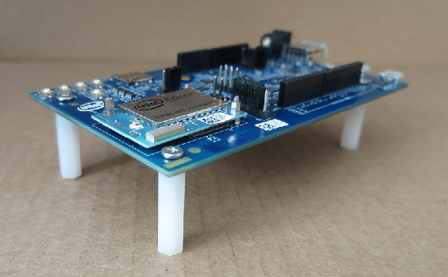


### 连接 Edison

* 插上电源适配器
* 插上两个 usb 接口到电脑上
* 把右侧中间的开关拨到下面

 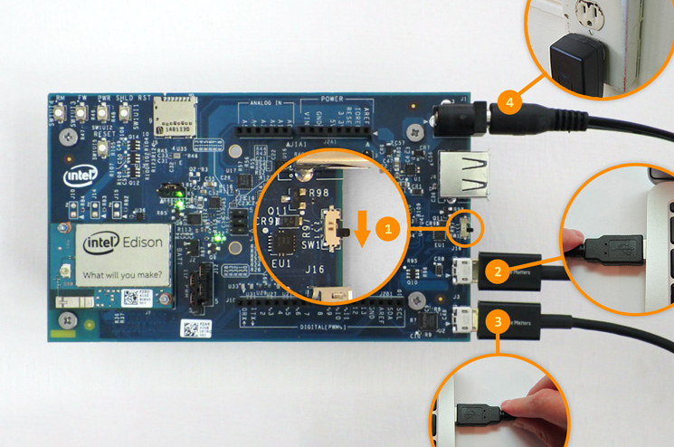

------

* 一旦成功连接, Edison 正常启动, 在 Windows 就会出现一个 Edison 的盘符

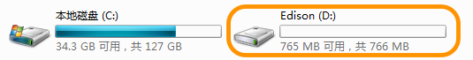


## 安装 Arduino

- 运行软件包中的 Arduino 安装包

 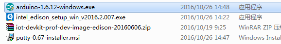

------

- 安装中

 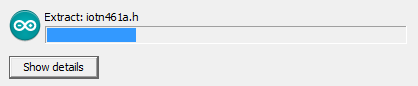

------

- 完成后打开桌面上的 Arduino, 打开 工具>>开发版>>开发版管理器

 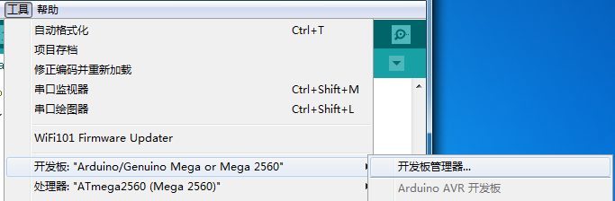

------

- 找到 Intel i686 Boards by Intel, 点击右边的安装(根据网络情况15~20分钟)

 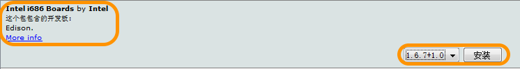


##  升级 Edison 最新固件, 并且配置 Edison

* 运行软件包中的 intel_edison_setup_win_v2016.2.007.exe

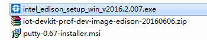

------

* 点击下一步后, 选择安装驱动


------


* 驱动安装中(大概需要5~10分钟)

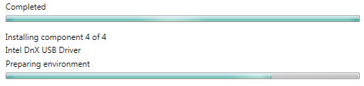

------


* 选择需要升级固件


------

* 为了减少网络下载时间, 使用软件包中的本地固件包进行更新


 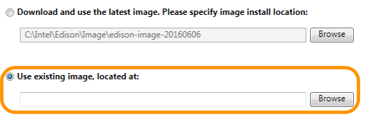

------

* 选中软件包中的 edison-image-ww18-15.zip 固件包

 

注意: 软件包中提供了两个固件包:

1. edison-image-ww18-15.zip 为老版固件, 可以完美兼容 Arduino IDE


2. iot-devkit-prof-dev-image-edison-20160606.zip 为最新版固件(2016-11-27为止), 但是对于 Arduino IDE 兼容性很差, 会造成上传程序无法运行的问题. ([详见这里](https://communities.intel.com/thread/77945))


------

* 固件更新中 (大概需要10~15分钟, 在这段时间, 可以安装 Arduino)

如果更新失败, 可以尝试[手动更新](https://software.intel.com/en-us/flashing-the-firmware-on-intel-edison-board)

 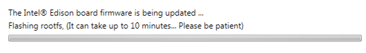

------

* 选择启用 SSH 对 Edison 进行初始化

 

------

* 给你的 Edison 起个名字,  然后按 Set Name 设置名字.

 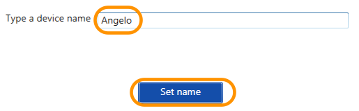

------

* 一旦设置成功就会显示:

 

------

* 输入密码
* **为了方便管理请务必设置成8个1 : 11111111**
* 然后按 Set password 设置:

 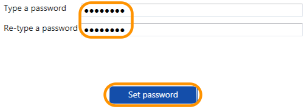

------

* 一旦成功就会显示:

 

------

* 最后选择连接 Wifi

 

------

* Edison 会自动扫描 WiFi
* 完成后选择 WiFi 网络并输入密码
* 按 Connect 进行连接

 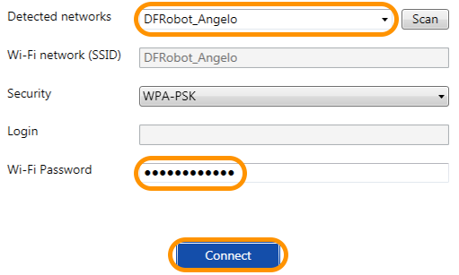

------

* WiFi 连接成功后会显示 IP 地址

 

------

* 全部完成后, 除了 Frimware version 所有的配置都会是绿色的勾

  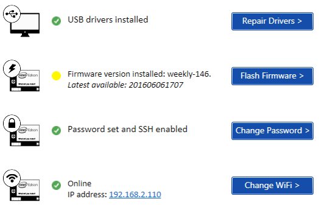


### FAQ

* 如果完成全部设置后, 电脑网络出现问题, 或者 Arduino 无法正常启动则需要禁用以下驱动

 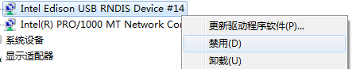


## 试一下 Blink 吧

* 打开 Blink 示例文件 文件 >> 示例 >> 01.Basics >> Blink

 

------

* 选择 Intel Edison 主控板 工具 >> 开发版: >> Intel Edison

 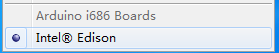

------

* 进入 Windows 计算机管理器

 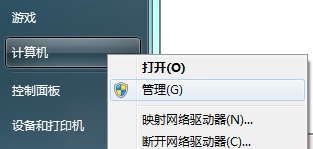

------

* 单击左边的设备管理器

 

------

* 展开端口, 里面可以看到 Intel Edison Virtual Com Port (COM*) 我们这边是 COM4 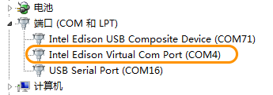

------

* 设置端口 工具 >> 端口 >> COM4

 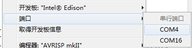

------

* 上传代码

 

------

* 这时候就可以看到小灯闪烁了.

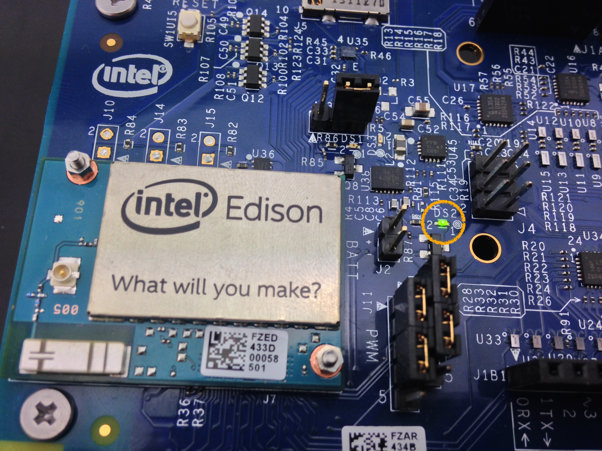


### FAQ

* 如果上传失败, 并提示 Read-only file system 错误, 请使用软件包里面的`usbser.sys`替换`C:\Windows\System32\drivers\usbser.sys`


## 解决系统掉电, 上传的程序丢失的问题

Edison 不像普通的 Arduino  主板. 重启掉电之后,  linux 内存中的数据来不及存储到存储器上. 为此我们需要通过 Putty 手动重启一下 Edison 来保证代码不会丢失.

* 安装软件包中的 Putty

 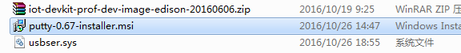

------

* 安装成功后打开 Putty, 进行以下设置

 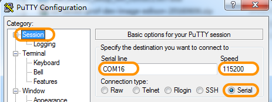

------

* 上图的 Serial line 是根据在设备管理器里面的 USB Serial Port (COM*) 决定的

  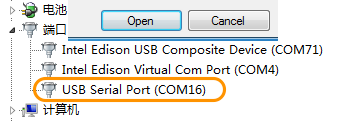

------

* 点击右下角的 Open 打开串口

 

------

* 按下回车, 然后键入 `root` , 之后输入之前设置的密码 (11111111)  

 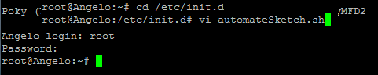

------

* 键入` reboot` 重启

```
reboot
```

 

------

* 此时不管如何掉电, 小灯依然闪烁, 证明设置成功.


## 做一个灯光调节器

* 旋转电位器, LED 的亮度就会发生改变

### 硬件连接图

 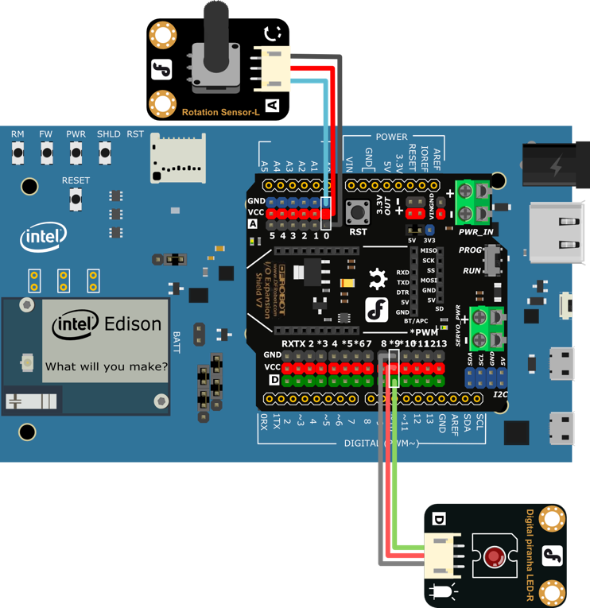


### 输入代码

```cpp
//灯光调节器
int potPin = 0;                   //电位器连接到模拟0
int ledPin = 9;                  //LED连接到数字9

void setup() {
       pinMode(ledPin, OUTPUT);
}

void loop() {
  int sensorValue = analogRead(potPin);    //读取模拟口0的值       
  //通过map()把0~1023的值转换为0~255
int outputValue = map(sensorValue, 0, 1023, 0, 255);   
analogWrite(ledPin, outputValue);   //给LED写入对应值        
  delay(2);                     
}  
```

